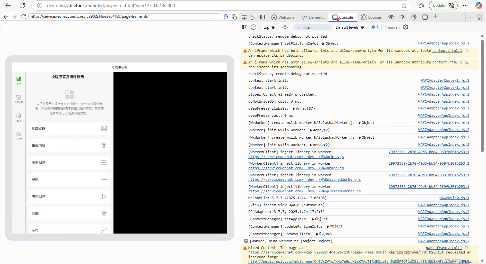

# WMPFDebugger

Yet another WeChat miniapp debugger on Windows (WMPF).

This debugger (tweak) exploits Remote Debug feature provided by wechatdevtools and patches serval restrictions to force miniapp runtime to support full Chrome Debug Protocol, and thus can be directly applied to standard devtools shipped with chromium-based browsers.


## Support Status

Note: Only miniapp component is supported.

Version histories:

* 11633 (latest)

To check your installed version, navigate to Task Manager -> WeChatAppEx -> Right click -> Open file location -> Check the number between `RadiumWMPF` and `extracted`.

To adapt to another version, find x-refs mentioned in `frida/hook.js` in IDA Pro to locate function offsets.


## Prerequisites

* node.js
    - yarn
* chromium-based browsers (e.g., Chrome, Edge, etc.)

## Quick Start

**Step 1.** Clone this repo and install dependencies.

```bash
git clone https://github.com/evi0s/WMPFDebugger
cd WMPFDebugger
yarn
```

**Step 2.** Run `src/index.ts` to launch debug server and proxy server, and inject hook script to miniapp runtime.

```bash
npx ts-node src/index.ts
```

> Note: After this step, you need to launch the miniapp BEFORE launching the devtools, otherwise you will probably need to kill the server and redo the steps 2 to 4 again.

**Step 3.** Launch any miniapp you would like to debug.

**Step 4.** Open your chromium-based browsers, navigate to `devtools://devtools/bundled/inspector.html?ws=127.0.0.1:62000` and profit. You can change the CDP port `CDP_PORT` (62000 in this example) in `src/index.ts` to any port you like.

## Screenshots




